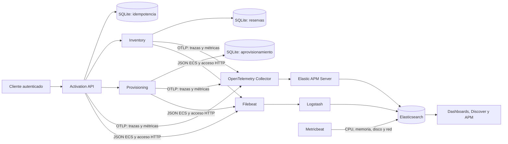
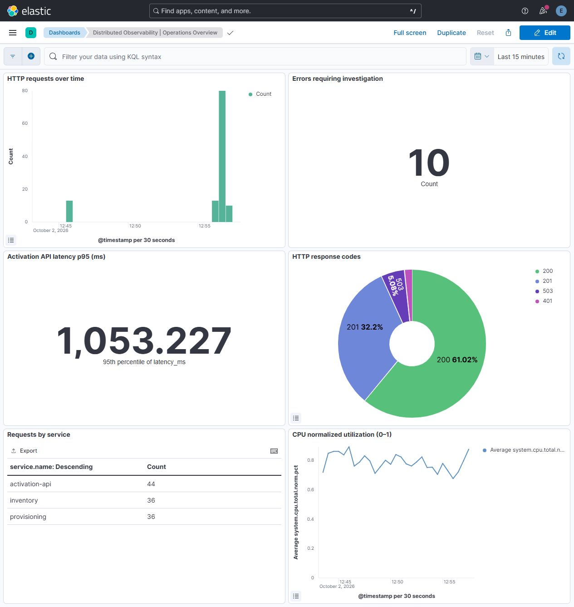

# Distributed Observability Platform

[](https://github.com/jorgefprietol/distributed-observability-platform/actions/workflows/ci.yml)

Plataforma de ingeniería para investigar latencia y fallos en un flujo distribuido de activación de servicios. Integra **Elasticsearch, Logstash, Kibana, Filebeat, Metricbeat y OpenTelemetry**, con tres microservicios HTTP, persistencia de idempotencia y entrega automatizada de imágenes.

El caso de negocio permite activar un plan de conectividad, evaluar capacidad y ejecutar aprovisionamiento. Las dependencias son servicios sintéticos: el proyecto demuestra instrumentación y operación verificables sin requerir infraestructura de una operadora.

## Arquitectura



- Propagación W3C `traceparent` entre los tres servicios y respuesta `X-Trace-ID`.
- Logs JSON ECS con `trace.id`, `span.id` e identificadores de activación.
- Procesamiento de acceso HTTP con grok, GeoIP, normalización de tipos y cuarentena de eventos inválidos. Las IP públicas usadas para verificar GeoIP son fixtures sintéticos.
- Métricas de volumen y duración HTTP por ruta y código de respuesta, exportadas por OTLP.
- Dashboard de seis paneles, tres data views y políticas ILM provisionados desde código.
- Retención de logs con rollover diario o por tamaño y eliminación a los siete días desde rollover; métricas de infraestructura eliminadas a los siete días desde creación.
- Escenarios protegidos de latencia y fallo, y evaluación de SLO mediante un comando con código de salida accionable.
- Identidad y solicitud persistidas antes de contactar dependencias; reconciliación mediante comprobantes durables, sin repetir efectos inciertos.



Captura del stack en ejecución con tráfico sintético, incluyendo incidentes controlados. La latencia se expresa en milisegundos y los conteos de volumen incluyen únicamente peticiones HTTP.

## Ejecutar

Requisitos: Docker con contenedores Linux, Docker Compose y Python 3.12. Reservar aproximadamente 6 GB de RAM libres para el stack y espacio para las imágenes Elastic. La primera ejecución necesita internet para descargar imágenes e instalar la integración APM.

```powershell
git clone https://github.com/jorgefprietol/distributed-observability-platform.git
cd distributed-observability-platform
python scripts/init-env.py --fault-injection
docker compose up -d --build --wait --wait-timeout 600
```

`--fault-injection` habilita los escenarios controlados. Omitirlo para aceptar únicamente activaciones normales. `.env` contiene credenciales aleatorias propias de la instalación y está excluido de Git y del contexto Docker.

| Componente | Dirección local |
| --- | --- |
| API y OpenAPI | http://127.0.0.1:18090/docs |
| Kibana | http://127.0.0.1:15601 |
| Elasticsearch autenticado | http://127.0.0.1:19200 |

En Kibana, entrar con el usuario `elastic` y el valor `ELASTIC_PASSWORD` de `.env`. Abrir **Dashboard → Distributed Observability \| Operations Overview**, o **Observability → APM → Services**. La cuenta administrativa se utiliza para provisión y consulta local; los emisores emplean `telemetry_ingest` con permisos restringidos.

```powershell
$configuration = @{}
Get-Content .env | ForEach-Object {
  if ($_ -match '^([^=]+)=(.*)$') { $configuration[$matches[1]] = $matches[2] }
}
$headers = @{
  Authorization = "Bearer $($configuration.API_TOKEN)"
  'Idempotency-Key' = [Guid]::NewGuid().ToString()
}
$body = @{ plan = 'fiber-100'; region = 'north'; scenario = 'normal' } | ConvertTo-Json
Invoke-WebRequest http://127.0.0.1:18090/api/v1/activations -Method Post -Headers $headers -ContentType application/json -Body $body
```

Cambiar `scenario` a `latency` introduce 350 ms en aprovisionamiento; `failure` devuelve 503 y marca la activación para reconciliación. Utilizar una clave nueva para cada solicitud distinta. Repetir una clave con el mismo cuerpo devuelve el resultado persistido; reutilizarla con otro cuerpo devuelve 409.

`response_loss` simula un 503 después de guardar el aprovisionamiento. `POST /api/v1/activations/{key}/reconcile` confirma ambos comprobantes mediante consultas GET y actualiza el resultado a activo; si falta un efecto, conserva el caso bloqueado. Inventario y aprovisionamiento guardan sus comprobantes en volúmenes propios y sobreviven a reinicios.

## Verificación

```powershell
python -m venv .venv
.\.venv\Scripts\python -m pip install --require-hashes -r requirements-dev.lock
.\.venv\Scripts\python -m ruff check .
.\.venv\Scripts\python -m ruff format --check .
.\.venv\Scripts\python -m pytest
.\.venv\Scripts\python scripts/e2e.py
.\.venv\Scripts\python scripts/incident-drill.py --restart
.\.venv\Scripts\python scripts/traffic.py --requests 30 --scenario normal
.\.venv\Scripts\python scripts/check-slo.py
```

Las pruebas E2E requieren la configuración con inyección de fallos habilitada. Comprueban correlación real de las tres aplicaciones, recepción de métricas OTLP y Metricbeat, procesamiento grok/GeoIP, cuarentena, errores, credenciales, privilegios, importación de dashboard y aplicación de ILM. Los informes quedan en `artifacts/`.

El ejercicio de incidentes verifica un acuse perdido, reinicia únicamente las tres aplicaciones y reconcilia mediante comprobantes persistidos. También comprueba que una dependencia que falló antes de generar su efecto siga bloqueada. Guarda `artifacts/incident-drill.json` con trazas y evidencia.

## GitHub Actions y entrega

El pipeline ejecuta calidad y pruebas en Windows y Linux, audita dependencias, construye una imagen, levanta el stack completo y verifica el flujo E2E. Escanea secretos y bloquea vulnerabilidades HIGH/CRITICAL con corrección disponible en la imagen de aplicación. Publica SBOM y evidencias como artifacts.

Sólo después de validar, `main` publica **la misma imagen probada** en `ghcr.io/jorgefprietol/distributed-observability-platform`, etiquetada con el SHA del commit y `main`, y genera una atestación de procedencia con OIDC. Los PR se ejecutan en runners hospedados y no publican imágenes. El escaneo bloqueante cubre la imagen propia; las imágenes de terceros deben someterse a evaluación y actualización en cada entorno destino.

Para usar una imagen publicada, establecer `APP_IMAGE=ghcr.io/jorgefprietol/distributed-observability-platform@sha256:<digest-verificado>` en `.env` y ejecutar `docker compose up -d --no-build --wait --wait-timeout 600`. El despliegue es reproducible por Compose; la promoción a un entorno remoto requiere una integración específica de ese entorno.

## Documentación

- [Diseño y decisiones](docs/architecture.md)
- [Contrato HTTP](docs/api.md)
- [Investigación de incidentes y SLO](docs/operations.md)
- [Ejercicio de diagnóstico y recuperación](docs/incident-exercise.md)
- [Capacidades y experiencia demostrable](docs/experience.md)
- [Evidencias de verificación](docs/verification.md)

## Alcance operativo

El despliegue incluido usa un nodo Elastic, conexiones HTTP en una red Docker local y puertos ligados a loopback. Las aplicaciones usan usuario sin privilegios, filesystem de sólo lectura y límites de recursos. Para otros entornos: TLS, gestión externa de secretos, roles de lectura, capacidad, backups y alta disponibilidad deben adaptarse a sus requisitos.

Metricbeat informa del entorno Linux visible al contenedor y no del sistema Windows anfitrión. Los efectos sintéticos son filas durables: cada servicio usa SQLite con un único proceso. La reconciliación confirma efectos guardados; no implementa compensación ni una transacción distribuida. Un adaptador hacia un proveedor externo necesitaría su propio contrato de idempotencia y comprobantes autoritativos.

Licencia MIT para el código propio. Los componentes Elastic conservan sus licencias respectivas.
